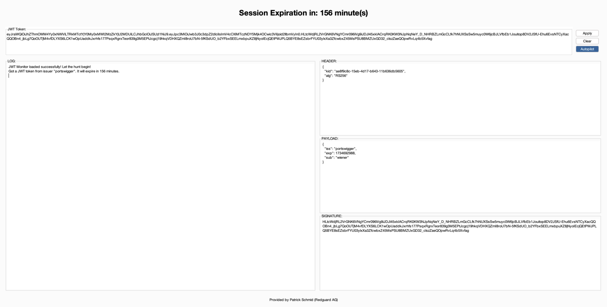

# JWT Monitor

_By Patrick Schmid_

This Burp Suite extension monitors a provided JWT token for its expiration and replaces any already present JWT token in outgoing requests with the provided one. In addition, if autopilot mode is activated, the extension automatically pauses task execution when the provided JWT token is about to expire within the next minute. Task execution resumes automatically again when a new JWT token with at least three minutes of validity left is supplied.

### Releases

Releases can be found in [build/libs](./../../tree/main/build/libs).

### How to build the project

In IntelliJ click the Elephant Symbol on the far right hand bar and visit `Tasks -> shadow -> shadowJar`

### Intellij debugger

To set up the Intellij debugger, we first need to tell Burp Suite to allow debugging with these steps:
1. Add the line `-agentlib:jdwp=transport=dt_socket,address=localhost:8700,server=y,suspend=n` to `/Applications/Burp Suite Professional.app/Contents/vmoptions.txt`
2. Open Burp Suite
3. In IntelliJ Open the Menu and choose `Run -> Attach to Process`. Choose the Burp Suite process listening on port 8700
4. Set a breakpoint in the "YourBurpKotlinExtensionName" class by clicking the line number next to the hello world statement
5. Load (or reload with ctrl + click) your extension and watch it stop at the breakpoint inside of IntelliJ